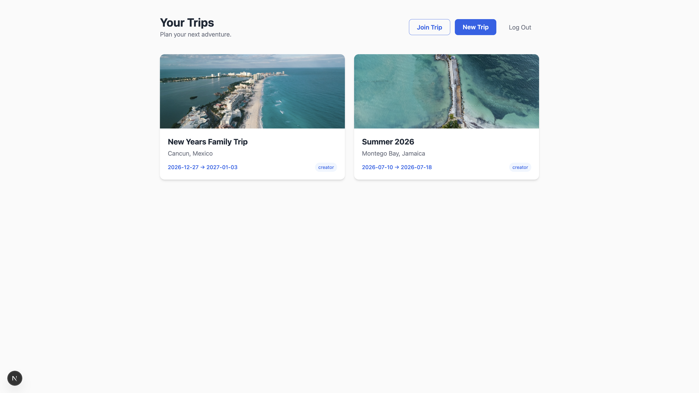
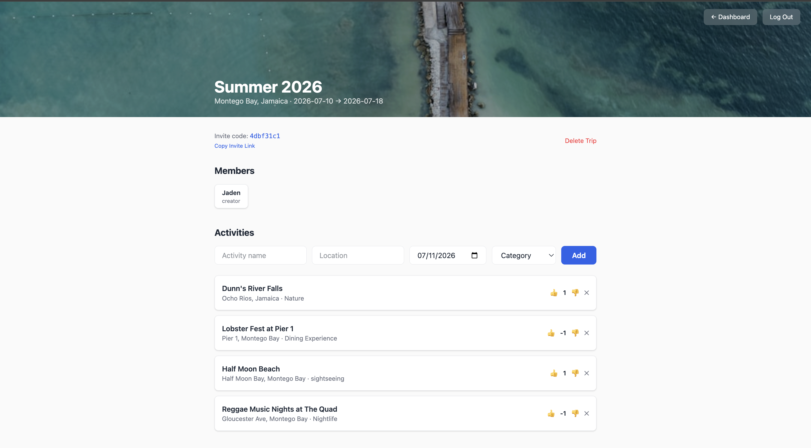
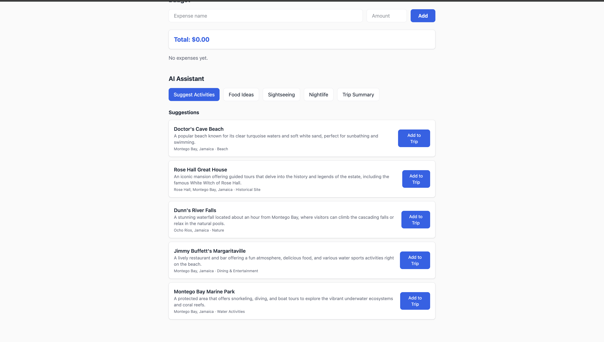
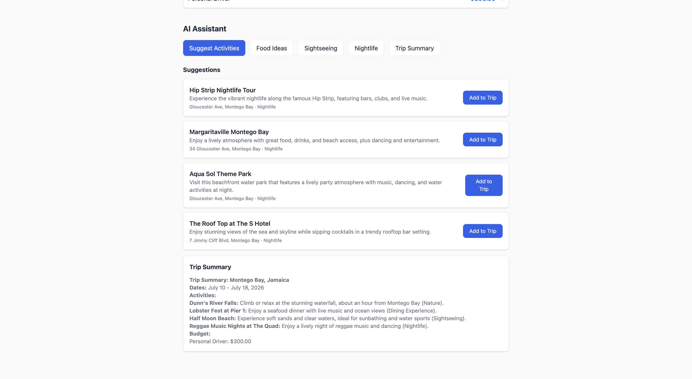

# Trip Planner

A collaborative trip planning app where groups can build itineraries together in real time, vote on activities, track budgets, and get AI-powered suggestions.



## Features

- **Real-Time Collaboration** — Multiple users can edit the same trip simultaneously via WebSocket connections
- **AI-Powered Suggestions** — GPT-4o-mini generates activity recommendations based on destination, dates, and existing plans
- **Activity Voting** — Group members vote on activities to reach consensus on what to do
- **Budget Tracking** — Add expenses and see the running total for the trip
- **Trip Summaries** — AI generates a clean markdown summary of the entire trip plan
- **Invite System** — Share trips via invite code or direct link
- **JWT Authentication** — Secure email/password auth with hashed passwords and token-based sessions

## Tech Stack

### Backend
- **Framework:** Python, FastAPI
- **Database:** PostgreSQL (Neon) with SQLAlchemy ORM
- **Real-Time:** Socket.io (python-socketio)
- **AI:** OpenAI GPT-4o-mini
- **Auth:** JWT tokens with bcrypt password hashing
- **Deployment:** Railway

### Frontend
- **Framework:** Next.js, TypeScript, Tailwind CSS
- **Real-Time:** socket.io-client
- **HTTP Client:** Axios with token interceptor
- **Deployment:** Vercel

## Architecture

```
Next.js Frontend (Vercel)
        |
        ├── HTTP requests ──→ FastAPI Backend (Railway)
        |                           |
        ├── WebSocket ──────→ Socket.io Server
        |                           |
        |                     ├── SQLAlchemy ──→ PostgreSQL (Neon)
        |                     └── OpenAI API ──→ GPT-4o-mini
```

### Key Architecture Decisions

- **Decoupled frontend and backend** — Separate Python (FastAPI) and TypeScript (Next.js) codebases demonstrate ability to work across languages and deploy multi-service architectures
- **FastAPI over Express** — Shows Python proficiency alongside TypeScript; FastAPI's auto-generated docs at /docs speed up development
- **SQLAlchemy over Prisma** — Different ORM for a different language; demonstrates adaptability rather than framework lock-in
- **JWT over session-based auth** — Built authentication from scratch instead of using a library like NextAuth; deeper understanding of token flows
- **Socket.io rooms** — Each trip is a separate room so changes only broadcast to relevant users, not all connected clients
- **AI returns structured JSON** — Suggestions come back as parseable JSON, enabling "Add to Trip" buttons instead of just displaying text

## API Endpoints

| Method | Endpoint | Description |
|--------|----------|-------------|
| POST | /auth/register | Create account with hashed password |
| POST | /auth/login | Authenticate and receive JWT |
| GET | /trips/ | List current user's trips |
| POST | /trips/ | Create a new trip |
| GET | /trips/:id | Get trip details with members |
| POST | /trips/join/:code | Join trip via invite code |
| GET | /trips/:id/activities | List activities with vote counts |
| POST | /trips/:id/activities | Add an activity |
| POST | /trips/:id/activities/:id/vote | Vote on an activity |
| GET | /trips/:id/budget | List expenses with total |
| POST | /trips/:id/budget | Add an expense |
| POST | /trips/:id/suggest | Get AI activity suggestions |
| GET | /trips/:id/summary | Get AI trip summary |

## Database Schema

6 models with relational data:

- **User** — id, name, email, password_hash
- **Trip** — id, name, destination, dates, invite_code, created_by
- **TripMember** — junction table linking users to trips with roles
- **Activity** — name, location, date, category, linked to trip and user
- **Vote** — user's vote on an activity (upvote/downvote)
- **BudgetItem** — expense name, amount, paid_by, linked to trip

## Screenshots

### Landing Page


### Dashboard


### Trip Detail — Activities & Voting


### AI Suggestions


### Budget Tracking


### Trip Summary


## Getting Started

### Prerequisites
- Python 3.12+
- Node.js 18+
- PostgreSQL database (Neon)
- OpenAI API key

### Backend Setup

```bash
cd backend
python3.12 -m venv venv
source venv/bin/activate
pip install -r requirements.txt
```

Create `backend/.env`:
```
DATABASE_URL=your_neon_connection_string
JWT_SECRET=your_secret_key
OPENAI_API_KEY=your_openai_key
```

Run the server:
```bash
uvicorn main:socket_app --reload
```

API docs available at http://127.0.0.1:8000/docs

### Frontend Setup

```bash
cd frontend
npm install
```

Update `lib/api.ts` with your backend URL.

Run the dev server:
```bash
npm run dev
```

Visit http://localhost:3000

## Live Demo

- **Frontend:** https://trip-planner-omega-mocha.vercel.app
- **Backend API:** https://trip-planner-production-b12b.up.railway.app
- **API Docs:** https://trip-planner-production-b12b.up.railway.app/docs

## What I Learned

- Building a decoupled architecture with separate frontend and backend services
- Implementing JWT authentication from scratch including password hashing and token verification
- Real-time communication patterns with Socket.io rooms and event broadcasting
- Integrating OpenAI API for structured JSON responses that power interactive UI features
- Managing relational data with SQLAlchemy including many-to-many relationships via junction tables
- Deploying multi-service applications across Vercel and Railway